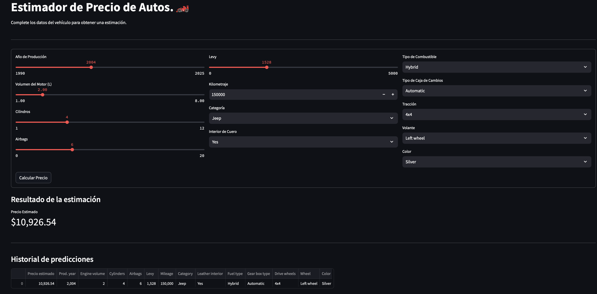

# Estimador de Precio de Autos.🏎️


Este proyecto implementa un sistema completo para **predecir el precio de automóviles usados** mediante Machine Learning, entrenado a partir de un dataset real.  

El usuario puede interactuar con una **aplicación web en Streamlit** e ingresar las características de un auto para obtener una estimación inmediata. Además, el proyecto incluye un sistema de historial para revisar predicciones previas dentro de la misma sesión.

---

## Contenidos del Proyecto

* Código de **preprocesamiento y entrenamiento del modelo**  
* Pipeline completo con:
  * Imputación de datos faltantes  
  * Escalado de variables numéricas  
  * Codificación de variables categóricas  
* Modelo entrenado y guardado como `car_price_model.pkl`  
* Aplicación **Streamlit** lista para ejecutar  
* Documentación del flujo y estructura  

---

## Vista Previa de la Aplicación



---

## Flujo Completo del Proyecto

### 1. Limpieza y Preparación de Datos

El dataset original (`carros.csv`) contiene características técnicas y estéticas de vehículos. Se aplicaron los siguientes pasos:

* Eliminación de columnas irrelevantes (`ID`, `Doors`)  
* Conversión de valores de texto a numéricos (por ejemplo `Levy`)  
* Normalización de campos como `"12 km"` a valores numéricos `12`  
* Conversión de variables categóricas a tipo `category`  
* Extracción del **volumen del motor** de cadenas como `"2.5 Turbo"`  
* Corrección de valores de **kilometraje inválidos**  
* Identificación y tratamiento de **valores faltantes**  

### 2. Ingeniería de Características

Se agruparon las variables según su tipo:

* **Numéricas:** escaladas con `StandardScaler`  
* **Numéricas con valores faltantes:** imputadas por **mediana** y escaladas  
* **Categóricas:** codificadas con `OneHotEncoder`  

Todo el preprocesamiento se encapsuló en un **ColumnTransformer** para asegurar reproducibilidad y evitar fugas de datos.

### 3. Entrenamiento del Modelo

Se entrenó un `RandomForestRegressor` con:

* `n_estimators=100`  
* `random_state=1` para reproducibilidad  

El modelo se integró en un **Pipeline** junto al preprocesador.

### 4. Evaluación del Modelo

Se calcularon métricas clave:

* **RMSE:** raíz del error cuadrático medio  
* **R² Score:** medida del poder explicativo del modelo  

Estas métricas permiten validar que el modelo **generaliza adecuadamente**.

### 5. Exportación del Modelo

El modelo final se guardó usando `joblib`:

```python
import joblib

# Guardar modelo entrenado
joblib.dump(rf_model, 'car_price_model.pkl')
```

---

## Librerías y Herramientas Usadas

* `pandas` y `numpy` para manipulación de datos  
* `scikit-learn` para pipelines y modelos ML  
* `Streamlit` para la interfaz interactiva  
* `joblib` para persistencia del modelo  

---

## Objetivo del Proyecto

Demostrar cómo un **dataset crudo** puede transformarse en un **modelo funcional** e integrarse en una interfaz accesible para **usuarios no técnicos**.
